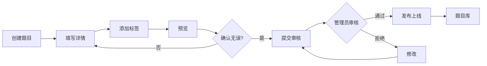

# 教师端功能设计文档

## 📚 目录
- [1. 教师端概述](#1-教师端概述)
- [2. 核心功能模块](#2-核心功能模块)
- [3. 用户界面设计](#3-用户界面设计)
- [4. 数据权限设计](#4-数据权限设计)
- [5. 业务流程设计](#5-业务流程设计)
- [6. 教师端特色功能](#6-教师端特色功能)

---

## 1. 教师端概述

### 1.1 设计目标

为教师提供完整的教学管理和内容创作平台，实现：
- ✅ 高效的内容创作与管理
- ✅ 便捷的学生管理与数据分析
- ✅ 智能的教学辅助与质量监控
- ✅ 完善的互动与反馈机制

### 1.2 用户画像

**目标用户**：
1. **专业讲师** - 拥有丰富教学经验，需要系统化管理课程和学生
2. **技术专家** - 行业从业者，分享实战经验和面试技巧
3. **在校教师** - 高校教师，辅助学生就业面试准备
4. **企业HR** - 企业面试官，贡献真实面试题和经验

**用户需求**：
- 快速创建和管理题目、知识点、教程
- 组织课程和班级，追踪学生学习进度
- 高效批改作业，提供个性化指导
- 数据分析支持，了解教学效果

### 1.3 角色权限

| 权限项 | 教师 | 管理员 | 学生 |
|-------|------|--------|------|
| 创建题目 | ✅ | ✅ | ❌ |
| 审核题目 | ❌ | ✅ | ❌ |
| 创建课程 | ✅ | ✅ | ❌ |
| 管理班级 | ✅ | ✅ | ❌ |
| 批改作业 | ✅ | ✅ | ❌ |
| 查看学生数据 | ✅ (自己的学生) | ✅ | ❌ |
| 答疑解惑 | ✅ | ✅ | ❌ |

---

## 2. 核心功能模块

### 2.1 内容创作模块 ✍️

#### 2.1.1 题目管理

**功能列表**：

| 功能 | 说明 | 优先级 |
|------|------|--------|
| 创建题目 | 支持选择题、简答题、编程题、系统设计题 | P0 |
| 编辑题目 | 富文本编辑器，支持代码高亮、图片 | P0 |
| 题目分类 | 按技术栈、难度、公司标签分类 | P0 |
| 批量导入 | Excel/JSON格式批量导入 | P1 |
| 题目预览 | 提交前预览效果 | P1 |
| 版本管理 | 题目修改历史记录 | P2 |
| 题目复制 | 基于已有题目创建新题 | P2 |

**操作流程**：
```
1. 选择题目类型 → 2. 填写基本信息 → 3. 编写题目内容 →
4. 设置答案和解析 → 5. 添加标签 → 6. 预览 → 7. 提交审核
```

**页面元素**：
- 题目类型选择器
- 富文本编辑器（支持Markdown）
- 代码编辑器（支持语法高亮）
- 标签选择器（技术栈、难度、公司）
- 知识点关联
- 参考答案编辑区
- 详细解析编辑区
- 题目统计展示（答题人数、正确率）

#### 2.1.2 知识点管理

**功能列表**：
- 创建知识点（Markdown编辑）
- 知识点分类与标签
- 设置难度和重要度
- 关联前置知识点
- 添加扩展阅读资料
- 插入代码示例
- 上传配图

**知识点模板**：
```markdown
# 知识点标题

## 概述
简要说明该知识点的核心内容

## 详细说明
### 1. 基本概念
### 2. 工作原理
### 3. 使用场景

## 代码示例
```java
// 示例代码
```

## 注意事项
- 关键点1
- 关键点2

## 扩展阅读
- [参考资料1](url)
- [参考资料2](url)
```

#### 2.1.3 教程创作

**功能列表**：
- 创建系列教程
- 章节组织管理
- 视频上传与管理
- 配套练习题设置
- 教程发布与更新

### 2.2 课程管理模块 📖

#### 2.2.1 课程创建

**课程信息**：
- 基本信息（标题、描述、封面）
- 课程分类与标签
- 难度级别
- 预计学时
- 适合人群
- 学习目标

**课程结构**：
```
课程
├── 章节1
│   ├── 知识点1
│   ├── 知识点2
│   └── 练习题
├── 章节2
│   ├── 视频教程
│   ├── 知识点3
│   └── 编程题
└── 章节3
    ├── 系统设计题
    └── 项目实战
```

#### 2.2.2 学习路径设计

**路径规划**：
1. 定义学习目标
2. 规划学习阶段
3. 设置里程碑
4. 配置检测点
5. 设计实战项目

**智能推荐**：
- 根据学生基础推荐起点
- 根据学习进度调整难度
- 根据薄弱点推荐专项练习

### 2.3 班级管理模块 👥

#### 2.3.1 班级创建与管理

**班级信息**：
- 班级名称与描述
- 关联课程
- 开班/结班时间
- 最大学生数
- 班级状态

**邀请机制**：
```
生成邀请码 → 学生输入邀请码 → 自动加入班级
```

**班级运营**：
- 发布班级公告
- 组织班级活动
- 查看班级统计
- 管理班级成员

#### 2.3.2 学生管理

**学生列表视图**：
| 学生姓名 | 加入时间 | 学习进度 | 作业完成率 | 平均分 | 活跃度 | 操作 |
|---------|---------|---------|-----------|--------|--------|------|
| 张三 | 2024-01-01 | 65% | 90% | 85 | 高 | 详情/私信 |
| 李四 | 2024-01-05 | 45% | 75% | 78 | 中 | 详情/私信 |

**学生详情页**：
- 基本信息
- 学习轨迹
- 能力雷达图
- 薄弱知识点
- 学习建议
- 历史成绩

### 2.4 作业管理模块 ✏️

#### 2.4.1 作业创建

**作业类型**：
- **练习作业** - 巩固知识点
- **阶段测验** - 检测学习效果
- **项目作业** - 综合实战

**作业设置**：
- 选择题目（从题库选择或新建）
- 设置总分和及格分
- 设置时间限制
- 设置开始和截止时间
- 是否允许延迟提交
- 自动批改/手动批改

#### 2.4.2 批改作业

**批改流程**：
```
查看提交列表 → 选择学生作业 → 逐题批改 →
评分 → 添加评语 → 提交批改结果 → 通知学生
```

**批改辅助**：
- 自动批改（选择题、编程题）
- 标准答案对照
- 常见错误提示
- 快捷评语库
- 批量操作

**批改视图**：
```
题目区域                  学生答案区域              批改区域
┌──────────────┐        ┌──────────────┐        ┌──────────────┐
│ 题目描述      │        │ 学生提交的答案 │        │ ✓ 正确       │
│              │        │              │        │ ✗ 错误       │
│ 参考答案     │        │              │        │ 得分: __/10  │
│              │        │              │        │ 评语: ______ │
└──────────────┘        └──────────────┘        └──────────────┘
```

### 2.5 数据分析模块 📊

#### 2.5.1 教学数据看板

**总览数据**：
- 总学生数 / 活跃学生数
- 创建内容数（题目/知识点/课程）
- 课程完课率
- 学生平均分
- 好评率

**趋势图表**：
```
学生增长趋势图
   ↗
  ↗
 ↗
━━━━━━━━━━━━→
1月 2月 3月 4月
```

#### 2.5.2 学生分析

**能力分析**：
- 学生能力雷达图
- 知识点掌握度
- 薄弱点识别
- 学习轨迹分析

**群体分析**：
- 班级整体表现
- 知识点掌握排行
- 进步最快学生
- 需要关注的学生

#### 2.5.3 内容质量分析

**题目质量指标**：
- 答题人数
- 平均正确率
- 平均用时
- 学生反馈评分
- 讨论热度

**优化建议**：
- 正确率过低 → 难度过高，建议调整
- 正确率过高 → 难度过低，建议提升
- 用时过长 → 题目表述不清，建议优化
- 反馈差评 → 答案有误或解析不详，需修正

### 2.6 互动答疑模块 💬

#### 2.6.1 学生提问管理

**提问列表**：
| 提问时间 | 学生 | 问题摘要 | 相关内容 | 状态 | 优先级 | 操作 |
|---------|------|---------|---------|------|--------|------|
| 2h前 | 张三 | ArrayList扩容机制 | Java集合 | 待回答 | 普通 | 回答 |
| 5h前 | 李四 | 红黑树为什么是平衡树 | 数据结构 | 待回答 | 高 | 回答 |

**回答编辑器**：
- 富文本编辑
- 代码高亮
- 插入图片
- 引用资料链接
- 保存草稿

#### 2.6.2 评论管理

**功能**：
- 查看题目评论
- 回复学生讨论
- 置顶精华评论
- 删除不当内容
- 鼓励优质评论

---

## 3. 用户界面设计

### 3.1 教师端首页

**布局结构**：
```
┌────────────────────────────────────────────────────┐
│ Logo     导航栏 (内容管理|课程管理|学生管理|数据分析)  │
├────────────────────────────────────────────────────┤
│                                                    │
│  欢迎回来，王老师！                   个人中心 退出  │
│                                                    │
│  ┌──────────┐  ┌──────────┐  ┌──────────┐        │
│  │ 我的学生  │  │ 待批作业  │  │ 待回答问题 │        │
│  │   156    │  │    23    │  │    8      │        │
│  └──────────┘  └──────────┘  └──────────┘        │
│                                                    │
│  ┌──────────────────────────────────────────┐    │
│  │  本周数据                                 │    │
│  │  ─────────────────────────────────────── │    │
│  │  学生活跃: 85%  ↑                        │    │
│  │  作业完成率: 92%  ↑                      │    │
│  │  平均分: 83  →                           │    │
│  └──────────────────────────────────────────┘    │
│                                                    │
│  最近活动                            查看更多 →   │
│  ─────────────────────────────────────────────── │
│  • 张三完成了《Java集合》练习                      │
│  • 李四提交了作业                                 │
│  • 王五对课程进行了评价                           │
│                                                    │
└────────────────────────────────────────────────────┘
```

### 3.2 题目管理页面

**题目列表**：
```
┌─ 筛选器 ────────────────────────────────────────┐
│ 状态: [全部▼] 分类: [全部▼] 难度: [全部▼]  🔍搜索 │
└────────────────────────────────────────────────┘

┌─ 题目列表 ──────────────────────────────────────┐
│ [新建题目] [批量导入]                 查看: ▦ ☰  │
├────────────────────────────────────────────────┤
│                                                 │
│ ┌────────────────────────────────────────────┐ │
│ │ ArrayList vs LinkedList区别                │ │
│ │ 选择题 | Java | 简单 | 👁 1234 | ✓ 85%     │ │
│ │ 状态: 已发布 | 创建: 2024-01-15            │ │
│ │ [编辑] [查看统计] [删除]                   │ │
│ └────────────────────────────────────────────┘ │
│                                                 │
│ ┌────────────────────────────────────────────┐ │
│ │ 实现LRU缓存算法                            │ │
│ │ 编程题 | 算法 | 中等 | 👁 856 | ✓ 62%      │ │
│ │ 状态: 待审核 | 创建: 2024-01-20            │ │
│ │ [编辑] [查看统计] [删除]                   │ │
│ └────────────────────────────────────────────┘ │
│                                                 │
└─────────────────────────────────────── [1][2][3]┘
```

### 3.3 学生管理页面

**学生列表与筛选**：
```
我的学生 (156人)

┌─ 筛选 ─────────────────────────────────────────┐
│ 班级: [全部▼] 活跃度: [全部▼] 进度: [全部▼]      │
│ 🔍 搜索学生...                                  │
└────────────────────────────────────────────────┘

学生姓名    加入时间    学习进度    作业完成率    平均分    活跃度
──────────────────────────────────────────────────────
张三        01-05      ██████░░  65%    90%      85      🟢 高
李四        01-08      ████░░░░  45%    75%      78      🟡 中
王五        01-10      ████████  85%    95%      92      🟢 高
──────────────────────────────────────────────────────
                                          [导出数据]
```

### 3.4 作业批改页面

**批改界面**：
```
┌─ 作业: Java集合练习 ─────────────────────────────┐
│ 学生: 张三 | 提交时间: 2024-01-20 15:30            │
│ 总分: 100 | 自动评分: 75 | 最终得分: ___          │
├────────────────────────────────────────────────┤
│                                                 │
│ 题目 1/10  [上一题] [下一题] [跳转]             │
│                                                 │
│ 【题目】                                        │
│ ArrayList和LinkedList的区别是什么？             │
│                                                 │
│ 【标准答案】                                    │
│ 1. 底层实现不同...                             │
│ 2. 性能特点不同...                             │
│                                                 │
│ 【学生答案】                                    │
│ ArrayList是数组实现的，查询快...               │
│                                                 │
│ 【评分】                                        │
│ ○ 正确(10分) ◉ 部分正确(  /10分) ○ 错误(0分)   │
│                                                 │
│ 【评语】                                        │
│ ┌─────────────────────────────────────────┐   │
│ │ 回答基本正确，但可以更详细说明使用场景...   │   │
│ └─────────────────────────────────────────┘   │
│                                                 │
│ [保存] [保存并下一题]                           │
│                                                 │
└────────────────────────────────────────────────┘
```

---

## 4. 数据权限设计

### 4.1 数据可见性规则

| 数据类型 | 教师可见范围 | 说明 |
|---------|-------------|------|
| 学生信息 | 自己班级的学生 | 不能查看其他教师的学生 |
| 题目 | 自己创建的题目 + 公开题目 | 可以引用公开题目 |
| 课程 | 自己创建的课程 | - |
| 班级 | 自己管理的班级 | - |
| 作业 | 自己布置的作业 | - |
| 统计数据 | 自己的教学数据 | - |

### 4.2 操作权限控制

**权限矩阵**：
```java
@PreAuthorize("hasRole('TEACHER')")
public class TeacherController {

    // 只能修改自己创建的题目
    @PreAuthorize("@permissionService.isQuestionOwner(#id, principal.username)")
    public void updateQuestion(Long id) { ... }

    // 只能查看自己班级的学生
    @PreAuthorize("@permissionService.isClassMember(#classId, principal.username)")
    public List<Student> getStudents(Long classId) { ... }
}
```

---

## 5. 业务流程设计

### 5.1 题目发布流程



### 5.2 课程创建流程

```
1. 创建课程基本信息
   ↓
2. 规划课程章节
   ↓
3. 添加课程内容
   - 关联知识点
   - 关联题目
   - 上传视频
   ↓
4. 设计学习路径
   ↓
5. 预览课程
   ↓
6. 发布课程
   ↓
7. 创建班级并邀请学生
```

### 5.3 作业批改流程

```
教师发布作业
    ↓
学生提交答案
    ↓
自动批改 (选择题、编程题)
    ↓
教师批改 (简答题、系统设计题)
    - 查看学生答案
    - 对照标准答案
    - 评分
    - 添加评语
    ↓
提交批改结果
    ↓
系统通知学生
    ↓
学生查看成绩和反馈
```

---

## 6. 教师端特色功能

### 6.1 智能批改助手

**功能**：
- 关键词匹配
- 语义相似度分析
- 常见错误识别
- 批改建议生成

**示例**：
```
学生答案: "ArrayList底层是数组"
标准答案: "ArrayList底层是动态数组实现"

智能分析:
✓ 关键词匹配: ArrayList, 数组
⚠ 缺少关键词: 动态
💡 建议: 学生理解基本正确，但应强调"动态"特性
```

### 6.2 教学质量报告

**周报内容**：
- 本周教学数据汇总
- 学生活跃度趋势
- 作业完成情况
- 薄弱知识点分析
- 下周教学建议

**月报内容**：
- 月度教学成果
- 学生进步排行
- 课程完课率
- 学生满意度
- 改进建议

### 6.3 学生画像

**数据维度**：
- 学习习惯（学习时段、频率）
- 知识掌握度（雷达图）
- 答题特点（准确率、速度）
- 互动情况（提问、讨论）
- 学习风格（理论型/实践型）

**应用场景**：
- 个性化学习建议
- 针对性辅导
- 分组教学依据
- 学习资源推荐

### 6.4 内容素材库

**功能**：
- 图片素材管理
- 代码模板库
- 常用图表库
- 引用资料库
- 个人素材收藏

**使用方式**：
```
创建题目时:
1. 点击"插入素材"
2. 选择素材类型
3. 从素材库选择或上传新素材
4. 插入到编辑器
```

### 6.5 教学日历

**功能**：
- 课程安排可视化
- 作业截止提醒
- 考试日程管理
- 重要事件标注

**视图**：
```
2024年1月

周一    周二    周三    周四    周五    周六    周日
1       2       3       4       5       6       7
        📝作业   📚课程           📝作业
        截止    Java集合          截止

8       9       10      11      12      13      14
📚课程   📝作业   📚课程   📝作业           ⚡考试
算法    截止    设计模式  截止            阶段测试
```

---

## 总结

教师端设计围绕"**高效、智能、数据驱动**"三大核心理念：

1. **高效** - 简化教师操作流程，提供批量操作、模板复用等功能
2. **智能** - 利用AI辅助批改、智能分析、个性化推荐
3. **数据驱动** - 提供全面的数据分析，支持教学决策

通过完善的教师端功能，既能提升教师的工作效率，又能保证教学质量，最终为学生提供更好的学习体验。
