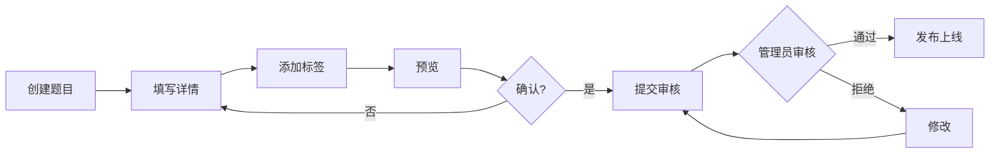

# 教师端设计更新说明

## 📝 更新概述

**更新日期**: 2025-12-17
**更新内容**: 在系统设计文档中增加完整的教师端设计
**影响范围**: 系统设计文档、数据库设计、API设计

---

## ✅ 本次更新内容

### 1. 系统设计文档更新

**文件**: `docs/系统设计文档.md`

#### 1.1 核心模块概览部分
新增 **模块五.5：教师端管理模块** 👨‍🏫

包含以下核心功能：
- ✅ 题库内容管理（创建、编辑、审核、质量管理）
- ✅ 知识库内容管理（知识点、教程、素材库）
- ✅ 学生管理与数据分析
- ✅ 课程与班级管理
- ✅ 互动与反馈（答疑、评论管理）
- ✅ 个人中心（教师专属）

#### 1.2 数据库设计部分
新增 **教师端相关表** 共13张表：

| 序号 | 表名 | 说明 |
|-----|------|------|
| 1 | teacher_profile | 教师信息扩展表 |
| 2 | course | 课程表 |
| 3 | course_chapter | 课程章节表 |
| 4 | course_content | 课程内容关联表 |
| 5 | class | 班级表 |
| 6 | class_member | 班级成员表 |
| 7 | assignment | 作业任务表 |
| 8 | assignment_submission | 作业提交表 |
| 9 | grading_record | 批改记录表 |
| 10 | content_review | 内容审核表 |
| 11 | teaching_statistics | 教学统计表 |
| 12 | teacher_qa | 教师答疑表 |
| 13 | course_rating | 课程评价表 |

#### 1.3 API接口设计部分
新增 **教师端模块API** 共80+个接口：

包含9大功能模块的接口：
- 教师信息管理（4个接口）
- 题目管理（8个接口）
- 知识点管理（5个接口）
- 教程管理（5个接口）
- 课程管理（12个接口）
- 班级管理（9个接口）
- 作业管理（10个接口）
- 学生管理（6个接口）
- 答疑管理（5个接口）
- 数据分析（5个接口）

---

### 2. 新建补充文档

#### 2.1 教师端功能设计文档
**文件**: `docs/教师端功能设计.md`

**内容概要**：
- 📚 教师端概述（设计目标、用户画像、角色权限）
- 🎯 核心功能模块详细设计（6大模块）
- 🎨 用户界面设计（4个核心页面）
- 🔐 数据权限设计（可见性规则、操作权限）
- 🔄 业务流程设计（3个核心流程）
- ✨ 教师端特色功能（5个创新点）

**文档特色**：
- 详细的功能描述和操作流程
- 直观的页面布局设计
- 完整的权限控制方案
- 实用的特色功能设计

#### 2.2 教师端与学生端功能对比文档
**文件**: `docs/教师端与学生端功能对比.md`

**内容概要**：
- 📊 功能对比总览表
- 📚 9大模块详细功能对比
- 🎯 用户体验对比
- 📱 界面风格对比
- 🔐 权限控制对比
- 💡 特色功能对比
- 🎓 使用场景对比
- 📈 数据统计对比

**文档特色**：
- 清晰的表格对比
- 完整的功能矩阵
- 实际的使用场景
- 协同工作流程

---

## 📊 设计亮点

### 1. 完整的教学管理体系

```
内容创作 → 课程规划 → 班级运营 → 作业批改 → 数据分析 → 教学优化
```

### 2. 智能化教学辅助

- 🤖 智能批改助手
- 📊 教学质量报告
- 👤 学生画像分析
- 📅 教学日历管理

### 3. 数据驱动决策

**三层数据体系**：
- **个人层**: 教师个人教学数据
- **班级层**: 班级整体表现数据
- **平台层**: 跨班级对比数据

### 4. 权限分级管理

```
管理员
  ├── 审核权限（内容审核、发布控制）
  └── 全局管理（所有数据可见）

教师
  ├── 创作权限（题目、知识点、课程）
  ├── 管理权限（自己的班级和学生）
  └── 分析权限（自己的教学数据）

学生
  └── 学习权限（浏览、学习、练习）
```

---

## 🎯 核心业务流程

### 1. 题目发布流程


### 2. 课程创建流程
```
创建基本信息 → 规划章节 → 添加内容 → 设计路径 →
预览 → 发布 → 创建班级 → 邀请学生
```

### 3. 作业批改流程
```
发布作业 → 学生提交 → 自动批改 → 手动批改 →
评分评语 → 提交结果 → 通知学生
```

---

## 📈 数据库设计亮点

### 1. 完善的关联关系

```
teacher_profile (教师)
    ↓
course (课程) ←→ course_chapter (章节)
    ↓
class (班级) ←→ class_member (成员)
    ↓
assignment (作业) ←→ assignment_submission (提交)
    ↓
grading_record (批改记录)
```

### 2. 灵活的内容管理

```sql
-- 课程内容关联表支持多种内容类型
content_type: KNOWLEDGE_POINT | QUESTION | TUTORIAL | VIDEO
```

### 3. 完整的审核机制

```sql
-- 内容审核表
status: PENDING | APPROVED | REJECTED | NEED_REVISION
```

---

## 🔌 API设计亮点

### 1. RESTful规范

```
GET    /api/teacher/questions        # 查询列表
GET    /api/teacher/questions/{id}   # 查询详情
POST   /api/teacher/questions        # 创建
PUT    /api/teacher/questions/{id}   # 更新
DELETE /api/teacher/questions/{id}   # 删除
```

### 2. 统一的命名空间

```
/api/teacher/*     # 教师端接口
/api/student/*     # 学生端接口（可选）
/api/admin/*       # 管理员接口
/api/public/*      # 公共接口
```

### 3. 细粒度的权限控制

```java
@PreAuthorize("hasRole('TEACHER')")
@PreAuthorize("@permissionService.isQuestionOwner(#id, principal.username)")
```

---

## 🎨 界面设计特点

### 1. 教师端首页

**核心元素**：
- 📊 数据概览卡片（学生数、待批作业、待回答问题）
- 📈 本周数据趋势
- 📝 最近活动动态
- ⚡ 快捷操作入口

### 2. 题目管理页面

**核心元素**：
- 🔍 强大的筛选器
- 📝 批量操作按钮
- 📊 题目统计展示
- ⚡ 快速编辑入口

### 3. 学生管理页面

**核心元素**：
- 👥 学生列表与筛选
- 📊 进度可视化
- 🎯 能力评估图表
- 💬 快速沟通入口

### 4. 作业批改页面

**核心元素**：
- 📝 题目与答案对照
- ✍️ 评分评语编辑器
- ⚡ 批量操作支持
- 📊 统计数据展示

---

## 💡 创新功能

### 1. 智能批改助手

**功能**：
- 关键词匹配
- 语义相似度分析
- 常见错误识别
- 批改建议生成

### 2. 教学质量报告

**周报**：
- 教学数据汇总
- 学生活跃度趋势
- 作业完成情况
- 薄弱知识点分析

### 3. 学生画像

**维度**：
- 学习习惯
- 知识掌握度
- 答题特点
- 互动情况

### 4. 内容素材库

**资源**：
- 图片素材
- 代码模板
- 常用图表
- 引用资料

### 5. 教学日历

**功能**：
- 课程安排可视化
- 作业截止提醒
- 考试日程管理

---

## 📋 实施建议

### 第一阶段：基础功能（2周）
- ✅ 教师信息管理
- ✅ 题目管理（创建、编辑、列表）
- ✅ 知识点管理（创建、编辑、列表）
- ✅ 基础权限控制

### 第二阶段：课程功能（2周）
- ✅ 课程创建与管理
- ✅ 章节规划
- ✅ 内容关联
- ✅ 学习路径设计

### 第三阶段：班级与作业（2周）
- ✅ 班级创建与管理
- ✅ 学生邀请与管理
- ✅ 作业发布
- ✅ 作业批改

### 第四阶段：数据分析（1周）
- ✅ 教学统计
- ✅ 学生分析
- ✅ 数据看板
- ✅ 报告生成

### 第五阶段：优化提升（1周）
- ✅ 智能批改
- ✅ 学生画像
- ✅ 素材库
- ✅ 教学日历

---

## 📚 相关文档

1. ✅ **系统设计文档** - `docs/系统设计文档.md`
   - 包含教师端模块设计
   - 包含教师端数据库设计
   - 包含教师端API设计

2. ✅ **教师端功能设计** - `docs/教师端功能设计.md`
   - 详细的功能模块设计
   - 完整的界面设计
   - 业务流程设计

3. ✅ **功能对比文档** - `docs/教师端与学生端功能对比.md`
   - 学生端与教师端功能对比
   - 权限对比
   - 使用场景对比

4. ✅ **API文档** - `backend/API文档.md`
   - 包含教师端所有API接口

---

## 🎯 后续工作

### 代码实现
1. 创建教师端相关Entity
2. 创建教师端Repository
3. 创建教师端Service
4. 创建教师端Controller
5. 前端页面开发

### 测试验证
1. 单元测试
2. 接口测试
3. 功能测试
4. 性能测试

### 文档完善
1. API接口文档
2. 数据库文档
3. 用户使用手册
4. 运维部署文档

---

## 📊 更新统计

| 项目 | 数量 |
|------|------|
| 新增模块 | 1个（教师端管理模块） |
| 新增数据表 | 13张 |
| 新增API接口 | 80+ 个 |
| 新增文档 | 3份 |
| 文档总字数 | 约 30000 字 |

---

## ✅ 检查清单

- [x] 系统设计文档更新
- [x] 核心模块设计完成
- [x] 数据库设计完成
- [x] API接口设计完成
- [x] 教师端功能设计文档创建
- [x] 功能对比文档创建
- [x] 更新说明文档创建

---

## 📝 总结

本次更新在原有系统设计基础上，**完整地添加了教师端设计**，形成了完整的三端（学生端、教师端、管理端）系统架构。

**核心价值**：
1. ✅ 完善了系统的用户角色体系
2. ✅ 提供了完整的教学管理功能
3. ✅ 实现了学生与教师的互动闭环
4. ✅ 建立了数据驱动的教学改进机制

**设计特点**：
- 📐 架构完整、层次清晰
- 🎯 功能全面、重点突出
- 💡 创新实用、易于实施
- 📊 数据驱动、持续优化

系统现在具备了完整的在线教育平台功能，可以支持教师创建内容、管理课程、辅导学生，同时为学生提供优质的学习体验！
